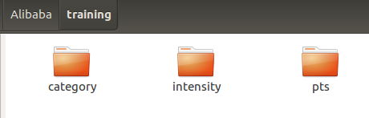
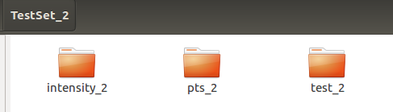
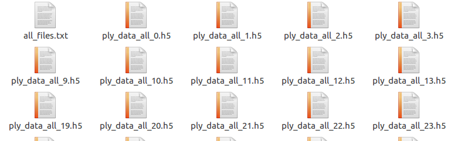
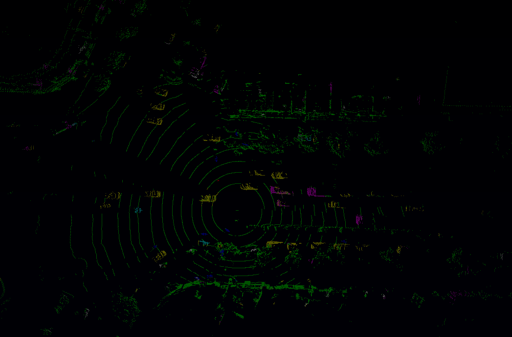

**Implementation on 3D LIDAR Point Cloud Semantic Segmentation Based on PointNet++**

_Notice：This repository is no longer maintained. It's a naive try by dividing scenes into grids and applying pointnet++._

By Xin Kong, Baoquan Zhong, Chang Zhou from CSC of Zhejiang University in Nov. 2018.  
This is the implementation of  [BDCI2018-自动驾驶三维点云分割](https://www.datafountain.cn/competitions/314/details/rule). (Team name: 试一下pointnet)  
Our final ranking is **9th / 1408**. The final IoU is around **0.19717355**, and the time consuming is around **4 sec/per frame**.  
Please contact <xinkong@zju.edu.cn>  

**Recommend configuration**   
***Hardware***  
CPU: i7 (Tested on i7-7700)
GPU: Geforce 1080ti or higher (Tested on TITAN XP)
RAM: Greater than 16G (Tested with 32G)  
***Software***  
The code has been tested with Python 3.5, TensorFlow 1.11.0, CUDA 9.0  on Ubuntu 16.04.

## Prepare  
### Prepare data  
Convert raw data to .npy files.

 
 

***Training data***
Please **change the paths** in line 10 and line 74-75 in **preprocess/collect_alibaba_train.py.**

	python preprocess/collect_alibaba_train.py

Sample blocks. Use some strategies to get blocks from data, which are the true training samples. Convert .npy files to hdf5 files.
Please **change line 24, 27 to your path**. If you want to change the strategies of sampling data, **change line 80 function**.

	python preprocess/gen_h5_alibaba_train_part_25000_1024_9_drop0.001.py

Then **copy these .h5 files paths to all_files.txt** in the same directory.

 

***Test data***
Please** change the paths** in line 10 and line 54 in** preprocess/collect_alibaba_test.py.**

	python preprocess/collect_alibaba_test.py

Copy these files path to **semantic/meta/alibaba_submit.txt**

### Compile Customized TF Operators
To compile the operators in TF version >=1.4, you need to modify the compile scripts slightly.

First, find Tensorflow include and library paths.

        TF_INC=$(python -c 'import tensorflow as tf; print(tf.sysconfig.get_include())')
        TF_LIB=$(python -c 'import tensorflow as tf; print(tf.sysconfig.get_lib())')
        
Then, add flags of `-I$TF_INC/external/nsync/public -L$TF_LIB -ltensorflow_framework` to the `g++` commands.
You should change the libararies path in **xxx.sh** files in **tf_ops** dir. 

## Train
Please **change these paths** in line 420 in the **train_xyzi_final_iter_all.py**

	train_files_path = '/media/data/train/outdoor_sem_seg_hdf5_data_train_part_25000_30_9_drop0.001/all_files.txt'
	test_files_path = '/media/data/train/outdoor_sem_seg_hdf5_data_test_part_25000_30_9_drop0.001/all_files.txt'
	    

You may need to reduce the batch_size if your GPU memory is insufficient. It will occupy 11711M GPU memory with batch size 32.

	cd semantic
	python train_xyzi_final_iter_all.py --log_dir log_final --batch_size 32

## Test
	python evaluate_ali_xyzi_final_fast.py --batch_size 32 --dump_dir final_dump --room_data_filelist meta/alibaba_submit.txt --model_path log_25000_xyzi_final_all_loop3/best_iou_iter7_epoch_0.ckpt
	
To save time, you can open 3 terminals to run 3 test in parallel. You may need to reduce the batch_size if your GPU memory is insufficient.

*Terminal1:*

	python evaluate_ali_xyzi_final_fast.py --batch_size 32 --dump_dir final_dump --room_data_filelist meta/alibaba_submit_p1.txt --model_path log_25000_xyzi_final_all_loop3/best_iou_iter7_epoch_0.ckpt

*Terminal2:*

	python evaluate_ali_xyzi_final_fast.py --batch_size 32 --dump_dir final_dump --room_data_filelist meta/alibaba_submit_p2.txt --model_path log_25000_xyzi_final_all_loop3/best_iou_iter7_epoch_0.ckpt

*Terminal3:*

	python evaluate_ali_xyzi_final_fast.py --batch_size 32 --dump_dir final_dump --room_data_filelist meta/alibaba_submit_p3.txt --model_path log_25000_xyzi_final_all_loop3/best_iou_iter7_epoch_0.ckpt
	
## Visualization
To visualize the prediction and the groundtruth data. It will generate .obj files.

	python evaluate_ali_xyzi_final.py --batch_size 32 --dump_dir final_dump/visu --room_data_filelist meta/alibaba_submit.txt --model_path log_25000_xyzi_final_all_loop3/best_iou_iter7_epoch_0.ckpt --output_filelist final_dump/visu/out.txt --visu

 

## Acknowledgements
We build our code based on [PointNet++](https://github.com/charlesq34/pointnet2) . Thanks for this greate work!

        @article{qi2017pointnetplusplus,
          title={PointNet++: Deep Hierarchical Feature Learning on Point Sets in a Metric Space},
          author={Qi, Charles R and Yi, Li and Su, Hao and Guibas, Leonidas J},
          journal={arXiv preprint arXiv:1706.02413},
          year={2017}
        }
        
## TODO
- Parallelize the sampling code
- Optimize the sampling strategies(remove ground and cluster) and selectively feed the blocks to the network to reduce the numbers of blocks
- Add post-processing to make one object one label
